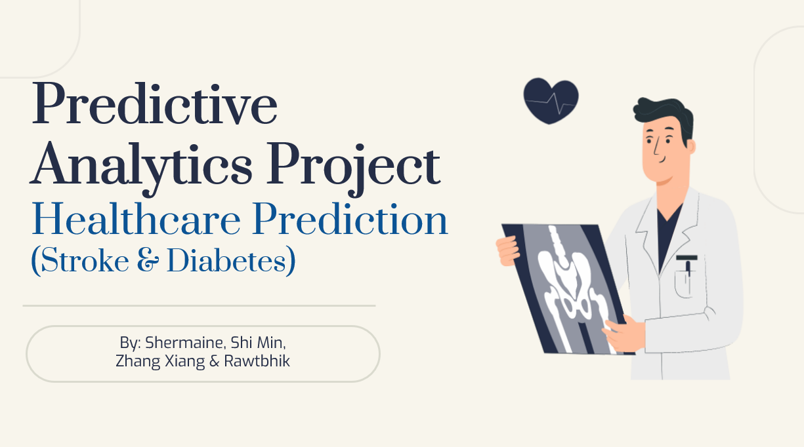

# SAS Predictive Analytics
- Using Supervised and Unsupervised Learning, completed Predicitve Modelling on Healthcare Industry, mainly on Stroke and Diabetes, using SAS Viya.
- 3 main goals of developing predictive models of 80% accuracy in predicting stroke and diabetes, pinpoint factors associated with those health problems, and help predict health problems more accurately. 

## Background 
- Our team discovered that the healthcare industry suffers from high attrition rates, hence face severe understaffing. Moreover, 1 in  201 patients face delayed treatment as a result of misdiagnosis or failure to seek help early enough. We, therefore, decided to focus on the healthcare industry before breaking it down into smaller factors. 

## Project Tasks
- Collect data from multiple sources using appropriate collection tools and techniques that comply with data and privacy ethics.
- Perform data pre-processing techniques to impute data, transform, reshape and protect the data in accordance with the business requirements and data protection principles.
- Apply relevant predictive modelling techniques to predict the desired business outcomes to meet the service expectation of the key stakeholders.

## Tools Used
- SAS Viya 
- KNIME
- Power BI 
- Tableau 

## Modelling Techniques 
- Decision Tree
- Feature Selection/ Dimension Reduction 
- Logistic Regression 
- Neural Network 
- Random Forest 
- Support Vector Machine 

## Detected Leading Factors of Common Health Problems
- Age
- High Blood Pressure
- Obesity 

## Roles 
- Shermaine --> Lead, Stroke 
- Shi Min --> Stroke 
- Zhang Xiang --> Diabetes
- Rawtbhik --> Diabetes
